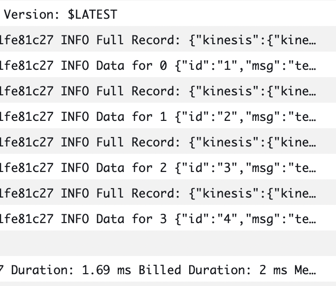

# Kinesis Ordered Events

This is a project using the AWS CDK development with TypeScript.

The `cdk.json` file tells the CDK Toolkit how to execute your app.

## How it works

Publish to the Kinesis data stream with a sequence id

`cron/publish-events.js` :

```
Robert.Bulmer@JJL9QKQXRL cron % node publish-events.js
hello world
processing event: 1
processing event: 2
processing event: 3
processing event: 4
processing event: 5
```

The lambda logs should indicate the messages in the same order they arrived:



## Useful commands

- `npm run build` compile typescript to js
- `npm run watch` watch for changes and compile
- `npm run test` perform the jest unit tests
- `cdk deploy` deploy this stack to your default AWS account/region
- `cdk diff` compare deployed stack with current state
- `cdk synth` emits the synthesized CloudFormation template
